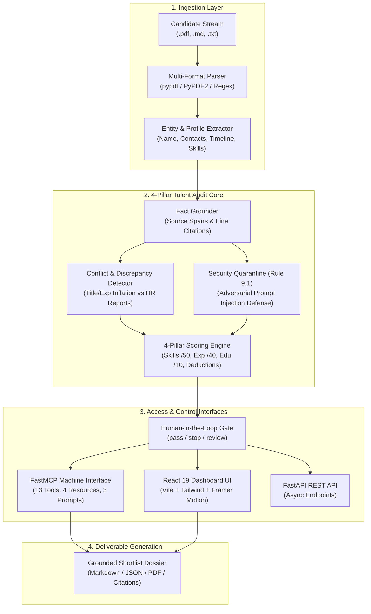
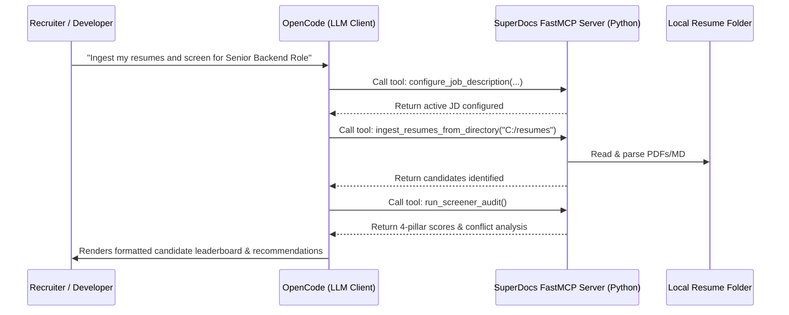

# 🌐 SuperDocs Talent Auditor — Architecture & FastMCP Reference

> **Complete Technical Guide: 4-Pillar Scoring Architecture, FastMCP Tool Catalog, OpenCode Integration & Server Distribution**

---

## 1. System Architecture Overview

The **SuperDocs Talent Auditor** is an autonomous, keyless-compatible document intelligence system. It transforms messy, multi-document hiring streams (PDF resumes, employment verifications, reference checks, job descriptions) into verified, line-grounded candidate scorecards and audit deliverables.



---

## 2. The 4-Pillar Transparent Scoring Engine

Candidates are evaluated through a deterministic, math-grounded scoring formula without black-box bluffing:

$$\text{Final Score} = \text{Skills} (50) + \text{Experience} (40) + \text{Education \& Projects} (10) - \text{Deductions}$$

| Pillar | Maximum Points | Calculation & Criteria |
|---|---|---|
| **Pillar 1: Technical Skills Match** | **50 Points** | Matched mandatory skills ratio $(\frac{\text{matched}}{\text{required}} \times 45) + \min(5.0, \text{extra skills} \times 1.0)$. |
| **Pillar 2: Experience Fulfillment** | **40 Points** | Proportional fulfillment $\min\left(1.0, \frac{\text{claimed\_years}}{\text{required\_min\_years}}\right) \times 40$. Detects experience deficits. |
| **Pillar 3: Education & Projects** | **10 Points** | 5 pts for technical degree (B.Tech, BS CS, MS, etc.) + 5 pts for verified production projects. |
| **Pillar 4: Red Flag Deductions** | **-10 to -50 pts** | **-50 pts** for adversarial prompt injection (Rule 9.1).<br>**-30 pts** for HR-verified experience inflation.<br>**-20 pts** for title inflation.<br>**-20 pts** for salary budget breaches. |

### Match Tier Classification:
- **Great Match** ($\ge 80$ pts, zero discrepancies, sufficient experience)
- **Good Match** ($65 - 79$ pts, zero security flags)
- **Moderate Match** ($50 - 64$ pts)
- **Low Match** ($< 50$ pts or flagged)

---

## 3. FastMCP Server Reference Catalog

The MCP server is implemented in `app/mcp/server.py` using the **FastMCP** framework.

### 🛠️ 13 Actionable FastMCP Tools

#### 1. `reset_candidate_pool()`
- **Purpose:** Resets the candidate pool, clears ingested documents, audit runs, pointers, and decisions.
- **Inputs:** None.
- **Returns:** Confirmation message and reset status.

#### 2. `configure_job_description(...)`
- **Purpose:** Configures the target role benchmark criteria against which all candidates are scored.
- **Inputs:** `title` (str), `required_skills` (str), `min_experience` (float), `nice_to_have` (str), `department` (str), `education_requirement` (str).
- **Returns:** Active job specification object with assigned ID.

#### 3. `ingest_resumes_from_directory(directory_path)`
- **Purpose:** Recursively scans a local folder and bulk-ingests all candidate resumes (`.pdf`, `.md`, `.txt`, `.markdown`).
- **Inputs:** `directory_path` (str, e.g. `"C:/Users/me/resumes"` or `"data/resumes"`).
- **Returns:** Total files ingested, names of candidates identified, and ingestion status.

#### 4. `upload_candidate_pdf(file_path)`
- **Purpose:** Ingests a single local PDF or Markdown resume from disk, extracting text with page-aware fallback (`pypdf` $\rightarrow$ `PyPDF2`).
- **Inputs:** `file_path` (str, relative or absolute).
- **Returns:** Parsed profile (name, contacts, skills, experience, education).

#### 5. `upload_candidate_document(filename, raw_text)`
- **Purpose:** Directly uploads raw text content as a classified document (`resume`, `job_description`, `employment_verification`, `reference_check`).
- **Inputs:** `filename` (str), `raw_text` (str).
- **Returns:** Document ID, classification, and parsed entities.

#### 6. `run_screener_audit()`
- **Purpose:** Executes the full 4-pillar talent audit pipeline across all ingested resumes, cross-references HR verification records, quarantees prompt injections (Rule 9.1), computes scores, and populates the human gate.
- **Inputs:** None.
- **Returns:** `run_id`, candidate count, conflicts count, security findings, and leaderboard preview.

#### 7. `get_candidate_leaderboard(run_id, min_score, match_tier)`
- **Purpose:** Returns the ranked candidate leaderboard with 4-pillar score breakdowns, contact info, and gap analyses.
- **Inputs:** `run_id` (optional), `min_score` (int, default `0`), `match_tier` (optional, e.g. `"Great Match"`).
- **Returns:** Sorted leaderboard list with filter statistics.

#### 8. `get_candidate_dossier(candidate_id, run_id)`
- **Purpose:** Retrieves a comprehensive individual candidate dossier with line-grounded fact citations, tailored AI technical interview questions, projects, and recruiter pointers.
- **Inputs:** `candidate_id` (str, e.g. `"cand-emma-davis"`), `run_id` (optional).
- **Returns:** Complete candidate profile, tailored system design questions, and citations.

#### 9. `add_candidate_pointer(candidate_id, pointer_text)`
- **Purpose:** Attaches custom recruiter notes, assessment tags, or interview pointers to a candidate record.
- **Inputs:** `candidate_id` (str), `pointer_text` (str).
- **Returns:** Updated list of candidate pointers.

#### 10. `remove_candidate_pointer(candidate_id, pointer_index)`
- **Purpose:** Removes a specific recruiter pointer from a candidate by index.
- **Inputs:** `candidate_id` (str), `pointer_index` (int).
- **Returns:** Remaining pointers list.

#### 11. `compare_candidates(candidate_ids, run_id)`
- **Purpose:** Generates a side-by-side head-to-head comparison matrix between 2 or more candidates.
- **Inputs:** `candidate_ids` (List[str]), `run_id` (optional).
- **Returns:** Side-by-side matrix comparing scores, match tiers, skill coverage, and experience.

#### 12. `decide_candidate(candidate_id, action, notes)`
- **Purpose:** Executes human-in-the-loop gate decision (`"pass"` = Shortlisted, `"stop"` = Dismissed, `"review"` = Under Review).
- **Inputs:** `candidate_id` (str), `action` (str), `notes` (str).
- **Returns:** Decision confirmation and updated status label.

#### 13. `export_shortlist_dossier(run_id, save_to_path)`
- **Purpose:** Exports the finalized candidate interview shortlist and grounded fact audit register. Optionally writes a formatted Markdown or JSON report directly to disk.
- **Inputs:** `run_id` (optional), `save_to_path` (optional, e.g. `"exports/shortlist.md"`).
- **Returns:** Shortlist metadata, structured candidate list, formatted Markdown report, and saved file path.

---

## 4. How MCP Works with OpenCode

**Model Context Protocol (MCP)** is an open standard created by Anthropic and adopted across modern AI developer tools (OpenCode, Claude Desktop, Cursor, Antigravity).



### Communication Protocol:
- **Transport:** Standard Input/Output (`stdio`) over JSON-RPC 2.0.
- **Execution:** OpenCode spawns your Python environment as a subprocess (`python -m app.mcp.server`).
- **Tool Calling:** When OpenCode needs data or actions, it automatically sends JSON-RPC tool invocation requests and receives structured JSON responses.

---

## 5. How to Distribute & Connect the MCP Server

### ❓ Do I need to host or publish this server somewhere?

> **No, you do not need to host it on the cloud!**  
> In the Model Context Protocol ecosystem, **95% of MCP servers are run locally on the user's machine** via `stdio`. This provides maximum speed, zero hosting costs, and total privacy for sensitive data (like candidate resumes and contracts).

---

### 🔌 How Anyone Can Connect with OpenCode (Step-by-Step Guide)

For evaluators, recruiters, or teammates to connect their OpenCode client to your MCP server, follow these exact steps:

#### Step 1: Clone the Repository
```bash
git clone https://github.com/ajinkya-dharkar/superdocs-assignment.git
cd superdocs-assignment
```

#### Step 2: Create & Activate a Python Virtual Environment
- **Windows (PowerShell):**
  ```powershell
  python -m venv .venv
  .\.venv\Scripts\Activate.ps1
  ```
- **macOS / Linux:**
  ```bash
  python3 -m venv .venv
  source .venv/bin/activate
  ```

#### Step 3: Install Required Dependencies
```bash
pip install -r requirements.txt
```
*(Installs `fastmcp`, `pypdf`, `langgraph`, `fastapi`, and testing libraries)*

#### Step 4: Run Offline Verification (Smoke Test)
Ensure all 42 tests pass offline without API keys:
```bash
pytest
```
Or test the standalone autonomous screener driver:
```bash
python scripts/mcp_screener_driver.py
```

#### Step 5: Add Server to OpenCode Configuration
Add the server entry to your OpenCode configuration file (`opencode.json` or in OpenCode Settings $\rightarrow$ MCP Servers):

- **Windows Configuration (`opencode.json`):**
  ```json
  {
    "mcpServers": {
      "superdocs-talent-auditor": {
        "command": "C:/path/to/superdocs-assignment/.venv/Scripts/python.exe",
        "args": ["-m", "app.mcp.server"],
        "cwd": "C:/path/to/superdocs-assignment"
      }
    }
  }
  ```

- **macOS / Linux Configuration (`opencode.json`):**
  ```json
  {
    "mcpServers": {
      "superdocs-talent-auditor": {
        "command": "/absolute/path/to/superdocs-assignment/.venv/bin/python",
        "args": ["-m", "app.mcp.server"],
        "cwd": "/absolute/path/to/superdocs-assignment"
      }
    }
  }
  ```

#### Step 6: Restart OpenCode & Start Screening
Restart OpenCode. All **13 FastMCP tools**, **4 resources**, and **3 prompts** will be discovered automatically.

You can now instruct OpenCode in plain English:
> *"Ingest all resumes from my folder: `C:/path/to/resumes` and screen for a Senior Full-Stack Engineer role."*

---

### 🌐 Optional: Hosting as a Remote MCP Server (SSE / WebSockets)

If you want people to connect **without installing Python or cloning your repo**, FastMCP supports Server-Sent Events (SSE):

1. Run FastMCP over SSE in `app/mcp/server.py`:
   ```python
   mcp.run(transport="sse", host="0.0.0.0", port=8000)
   ```
2. Deploy the container to Render, Fly.io, or AWS.
3. Users connect in OpenCode simply by adding:
   ```json
   {
     "mcpServers": {
       "superdocs-remote": {
         "url": "https://your-deployed-app.onrender.com/sse"
       }
     }
   }
   ```
